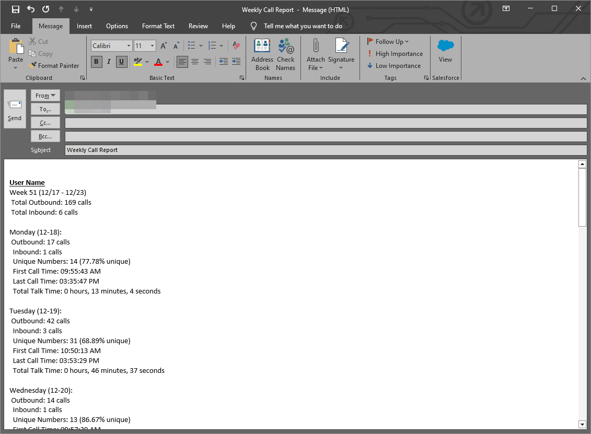

# Teams Call Daily/Weekly Breakdown
Tallys up total calls per day and some other stats from orig CSV from Microsoft Teams admin center PTSN Usage Report

## Overview
It will generate detailed reports on call activities, such as counts of inbound and outbound calls, call durations, unique number count, first/last call times and format them in a new HTML email message ready. The tool provides flexibility in selecting specific users or time ranges for reporting and can automatically draft an email with the report using Outlook. Now ran from a batch script, for quicker usage.

## Features
- **CSV File Processing**: Read and process call data from CSV files.
- **User Selection**: Customize reports by including or exempting specific users.
- **Flexible Date Ranges**: Option to report on the entire dataset or focus on the previous week.
- **Call Analysis**: Detailed insights into call counts, directions, and durations.
- **Outlook Email Integration**: Create Outlook email drafts with the report content for easy distribution.
- **Interactive User Interface**: Simple prompts and inputs for easy operation.
- **Unique Numbers Dialed Count and Percentage**: Shows the Unique Number/Percentage of calls
- **First and Last Call Time**: Shows the first and last call time

Example:

## Usage
### Using the Batch Script for Automated Execution
1. Place the batch script in the same directory as `search.py`.
2. Ensure that the directory contains the CSV files downloaded from the Microsoft Teams admin center.
3. Run the batch script. It will automatically:
   - Find the latest CSV file in the directory.
   - Run `search.py` with the latest CSV file, including '-inout' and '-talktime' arguments.
4. The script will output the results to a new Email to be sent via Outlook.
